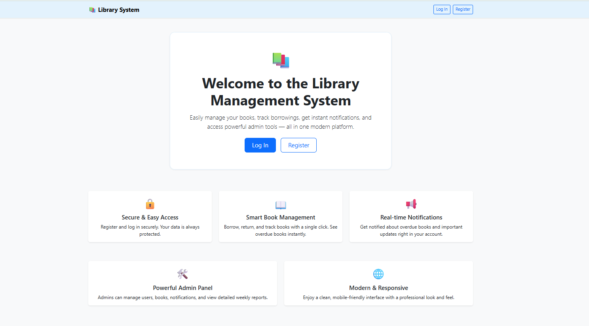

# Library Management System 📚

This project is a full-stack **Library Management System** developed as a case study for a company technical assessment. It is designed to manage book lending, user registrations, overdue reminders, notifications, and admin reporting with a modern, user-friendly interface.



---

## 🚀 Features

- **User Registration & Login** (with secure password hashing)
- **Book Borrowing & Returning**
- **Overdue Book Reminders** (Celery background tasks)
- **In-app Notifications** for users (with read/delete options)
- **Admin Panel**
  - Manage books and users
  - View overdue books
  - View and manage notifications
  - View email logs
  - Generate and view weekly reports (with statistics)
- **Modern UI** (Bootstrap 5, responsive, clean design)
- **Favicon:** 📚 Book emoji for all pages

---

## 🛠️ Tech Stack

- **Backend:** FastAPI (Python)
- **Frontend:** Jinja2 Templates + Bootstrap 5
- **Database:** SQLAlchemy (default: SQLite, can be configured)
- **Background Tasks:** Celery + Redis
- **Authentication:** JWT (cookie-based)
- **Other:** Docker, Docker Compose

---

## ⚡ Quick Start (Recommended: Docker Compose)

### 🚀 **Easiest Way: One Command Setup**

1. Open a terminal and **go to the project folder**:
   ```bash
   cd library_case_py
   ```
2. Then just run:
   ```bash
   docker-compose up --build
   ```

This will automatically build and start the FastAPI app, Celery worker, and Redis. No manual steps required!

---

## ⚡ Manual Setup (Development)

### 1. Clone the Repository
```bash
git clone <repo-url>
cd library_case_py
```

### 2. Create and Activate Virtual Environment
```bash
python -m venv venv
source venv/bin/activate  # On Windows: venv\Scripts\activate
```

### 3. Install Dependencies
```bash
pip install -r requirements.txt
```

### 4. Start Redis (for Celery)
- **With Docker:**
  ```bash
  docker run -d -p 6379:6379 redis
  ```
- **Or install locally:** https://redis.io/download

### 5. Start the Application
```bash
uvicorn app.main:app --reload
```

### 6. Start Celery Worker (in a new terminal)
```bash
celery -A app.celery_config.celery_app worker --loglevel=info
```

### 7. (Optional) Start Celery Beat (for scheduled tasks)
```bash
celery -A app.celery_config.celery_app beat --loglevel=info
```

---

## 🖥️ Usage

- **Home Page:** `/`  
  View all books, borrow/return books, see your notifications.
- **Register:** `/register`  
  Create a new user account.
- **Login:** `/login`  
  Log in to your account.
- **Admin Panel:** `/admin`  
  Manage books, users, view overdue books, notifications, email logs, and generate weekly reports.
- **Weekly Report:** `/admin/weekly-report`  
  View detailed weekly statistics and library activity.

---

## ⚙️ Configuration

- **Environment Variables:**
  - `CELERY_BROKER_URL` (default: `redis://localhost:6379/0`)
  - `CELERY_RESULT_BACKEND` (default: `redis://localhost:6379/0`)
  - `SMTP_SERVER`, `SMTP_USERNAME`, `SMTP_PASSWORD` (for email, optional)
- **Database:**
  - Default is SQLite. For production, configure PostgreSQL/MySQL in `app/database.py`.

---

## 📋 Project Structure

```
b2metric_case/
├── app/
│   ├── main.py            # FastAPI app & routes
│   ├── models.py          # SQLAlchemy & Pydantic models
│   ├── crud.py            # DB operations
│   ├── tasks.py           # Celery tasks
│   ├── celery_config.py   # Celery & Beat config
│   ├── database.py        # DB connection
│   ├── db_seeder.py       # Initial data
│   └── ...
├── templates/             # Jinja2 HTML templates
├── requirements.txt
├── Dockerfile
├── docker-compose.yml
└── README.md
```

---

## 📝 Notes
- This project was developed as a technical case for a company. All features and code are original and tailored for the assessment.
- All notifications and reminders are visible in-app; emails are optional and can be enabled with SMTP config.
- The project is ready for local development and can be easily containerized for production.

---

## 📞 Contact
For any questions or feedback, please contact to me. 
